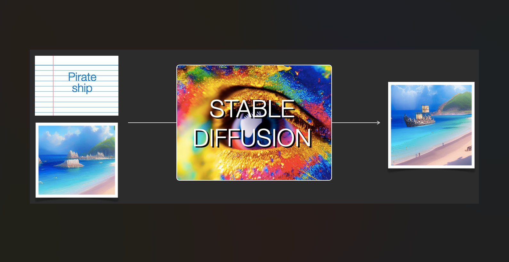
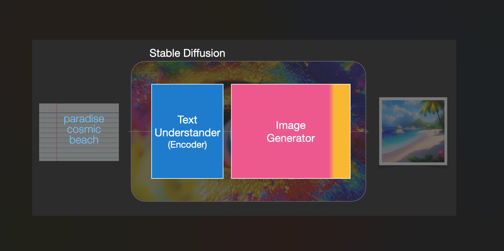
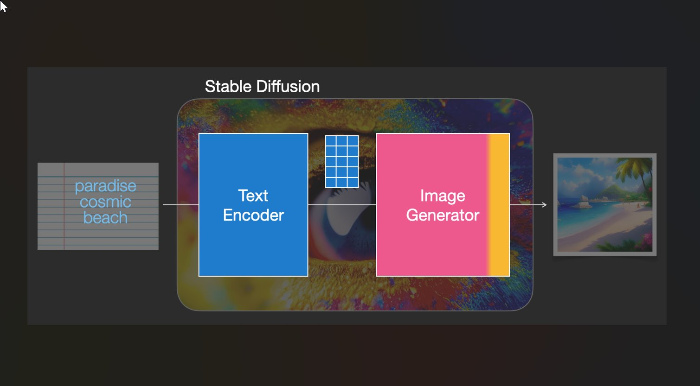
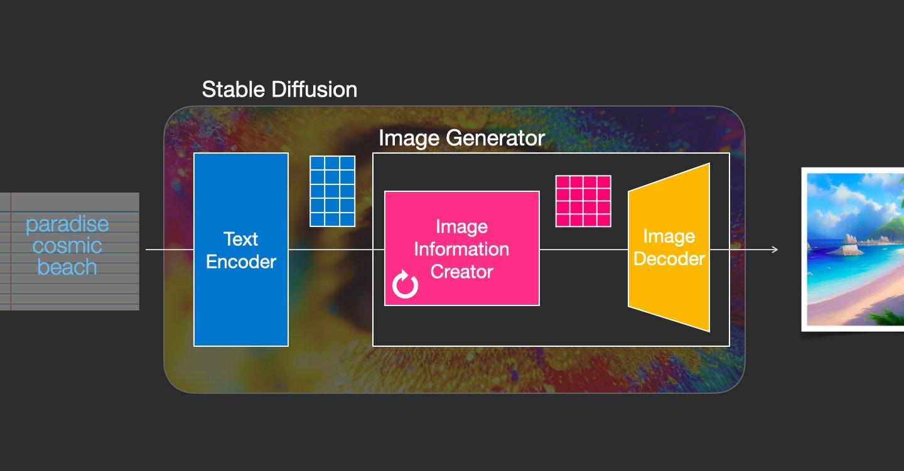
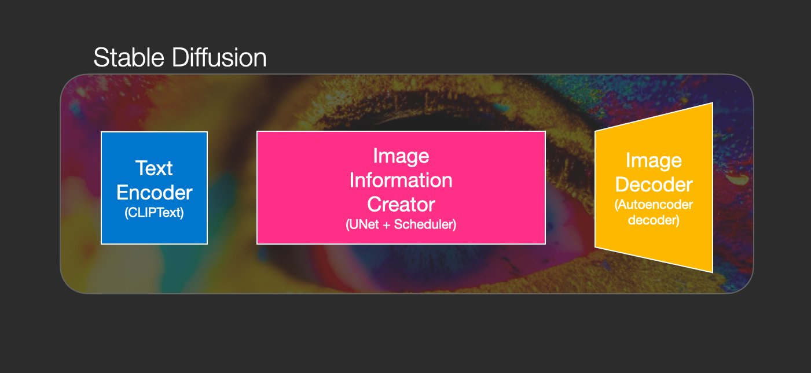
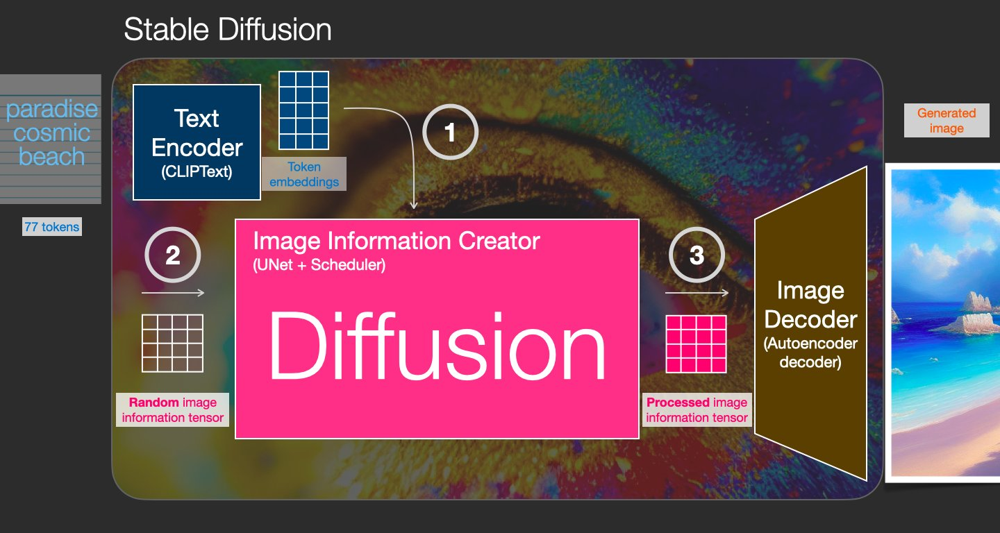
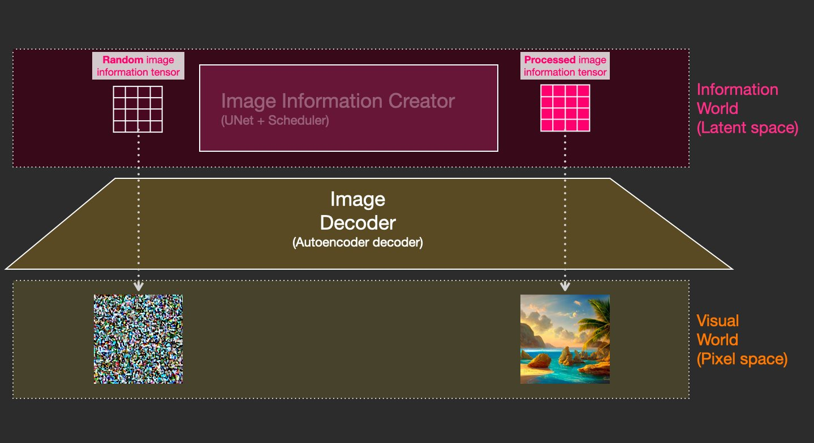
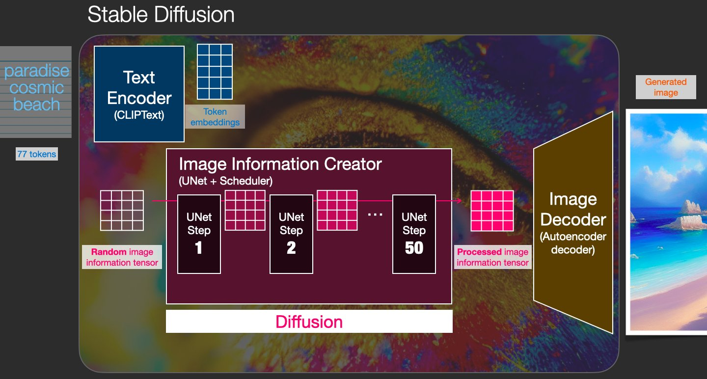

# Stable Diffusion--技术调研

**参考资料：**

1. Paper:  《[High-Resolution Image Synthesis with Latent Diffusion Models](https://arxiv.org/abs/2112.10752)》
2. Paper:  《[Learning Transferable Visual Models From Natural Language Supervision](https://arxiv.org/abs/2103.00020)》
3. StableDiffusion--Github： [CompVis / stable-diffusion](https://github.com/CompVis/stable-diffusion)
4. CLIP--Github:   [openai / CLIP](https://github.com/OpenAI/CLIP)
5. 官方网站： [High-Resolution Image Synthesis with Latent Diffusion Models](https://ommer-lab.com/research/latent-diffusion-models/)

**信息源：**

- [Twitter - Gradio](https://twitter.com/Gradio/status/1570519618682519553)
- [Reddit - r/StableDiffusion](https://www.reddit.com/r/StableDiffusion/comments/wqaizj/list_of_stable_diffusion_systems/)
- [Reddit - r/StableDiffusion/index](https://www.reddit.com/r/StableDiffusion/wiki/index/)
- [Reddit - r/bigsleep](https://www.reddit.com/r/bigsleep/comments/xb5cat/wiskkeys_lists_of_texttoimage_systems_and_related/)

**目前的主流技术实现方法( text-to-image)：**

- [Stable Diffusion](https://stability.ai/blog/stable-diffusion-public-release);
- [DALLE](https://openai.com/dall-e-2/);
- [Midjourney](https://www.midjourney.com/);

**Human face image transformation systems:**

- [CodeFormer](https://github.com/sczhou/CodeFormer)：人脸面部修复
- [GFP-GAN](https://github.com/TencentARC/GFPGAN)：人脸修复及着色
- [GPEN](https://github.com/yangxy/GPEN)：人脸修复

## **Stable Diffusion--技术简介贴：**

- 来源--Twitter:  [Jay Alammar](https://twitter.com/JayAlammar/status/1572297768693006337)

论文摘要：

> From 《Stable Diffusion》：
>
> **通过将图像形成过程分解为去噪自动编码器的连续应用，扩散模型（DMs）在图像数据和其他方面取得了最先进的合成结果。此外，它们的表述允许一个指导机制来控制图像生成过程，而无需重新训练**。然而，由于这些模型通常直接在像素空间中运行，强大的DMs的优化往往需要消耗数百个GPU天，并且由于顺序评估，推理的成本很高。为了使DM在有限的计算资源上进行训练，同时保留其质量和灵活性，我们在强大的预训练自动编码器的潜在空间中应用它们。与以前的工作相比，在这样的表征上训练扩散模型首次允许在降低复杂性和保留细节之间达到一个接近最佳的点，极大地提高了视觉保真度。通过在模型结构中引入交叉注意力层，我们把扩散模型变成了强大而灵活的生成器，用于一般的调节输入，如文本或边界框，并且高分辨率合成以卷积的方式成为可能。我们的潜伏扩散模型（LDMs）在图像绘制方面达到了新的技术水平，并在各种任务上取得了极具竞争力的性能，包括无条件的图像生成、语义场景合成和超分辨率，同时与基于像素的DMs相比大大降低了计算要求。

> From 《CLIP》：
>
> 最先进的计算机视觉系统被训练来预测一组固定的预定的物体类别。这种有限的监督形式限制了它们的通用性和可用性，因为需要额外的标记数据来指定任何其他视觉概念。直接从图像的原始文本中学习是一个很有前途的选择，它可以利用更广泛的监督来源。**我们证明，预测哪个标题与哪个图片相配这一简单的预训练任务是一种高效且可扩展的方式，可以在从互联网上收集的4亿对（图片、文本）数据集上从头开始学习SOTA图片表征**。在预训练之后，自然语言被用来引用所学的视觉概念（或描述新的概念），使模型能够零距离地转移到下游任务中。我们通过对30多个不同的现有计算机视觉数据集进行基准测试来研究这种方法的性能，这些任务包括OCR、视频中的动作识别、地理定位和许多类型的细粒度物体分类。该模型可以不费吹灰之力地转移到大多数任务中，并且通常与完全监督的基线竞争，而不需要任何特定的数据集训练。例如，我们在ImageNet的零点拍摄中与原始ResNet-50的准确度相当，而不需要使用它所训练的128万个训练实例中的任何一个。

AI 图像生成是最新的令人兴奋的 AI 功能。#StableDiffusion 是这一发展的一个明显里程碑，因为它为大众提供了一个高性能模型。这就是它的工作原理：

1. 它是多才多艺的，因为它可以以多种不同的方式使用。Text => Image（如上图）是主要用例。另一个是 (Image + Text) => Image (Like this image)。这称为img2img。

   

2. 稳定扩散是一个由多个组件和模型组成的系统。它不是一个单一的模型。当我们深入了解时，我们可以做出的第一个区别是：

   - 1- 文本理解组件
   - 2- 图像生成组件

   

3. 文本编码器是CLIP的文本编码器（https://arxiv.org/abs/2103.00020）。它接受输入文本并输出一个表示文本中每个标记的向量。然后将该信息呈现给图像生成器（由 2 个主要组件本身组成）。

   

4. 图像生成器经过两个步骤：

   - 1- 影像信息创造——稳定扩散的秘诀。运行多个步骤来优化图像中应包含的信息
   - 2-图像解码器，获取处理后的信息并绘制图片

   

5. 这将我们带到了图像创建过程的 3 个核心组成部分。单独的神经网络一起工作：
   - CLIPText：用于文本编码
   - U-Net + scheduler：逐步处理图像信息（潜在扩散）
   - 自动编码器解码器：绘制最终图像

   

6. **什么是扩散？** 这是将随机数字集合（“潜在张量”）转换为包含正确图像信息的经过处理的数字集合的过程。这是一个循序渐进的过程（稳定扩散中的“# Steps”参数）。

   

7. 我们实际上可以通过使用相同的图像解码器来可视化该过程。起始随机向量被绘制为随机噪声。
   Stable Diffusion 的速度提升来自这样一个事实，即这种处理发生在潜在空间中（计算量少于像素空间）。

   

8. 该过程中的每一步都在前一个输出（从随机张量开始）上应用一个神经网络（U-Net）。每一步都会消除噪音并添加更多视觉细节。它也由文本通知（cfg 参数决定了多少）。

   

